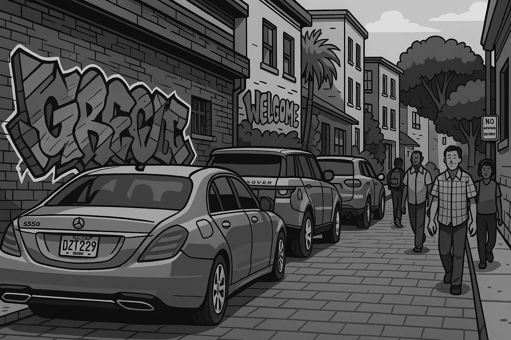

<p align="center">
  
</p>

# 🎉 Happy Birthday, myRuby 🎂💜

Welcome to a heartfelt, vibrant, and animated birthday project — handcrafted with love and code!  
This is a digital surprise built with **HTML**, **CSS**, and **JavaScript**, designed to celebrate someone special: **myRuby** 💝

## 🔥 Features

✨ Elegant UI with smooth transitions  
💖 Blurred and animated images  
🎵 Background music  
🎥 Slideshow with video  
🎉 Confetti, floating hearts, and music notes  
📱 Fully responsive and mobile-ready  
🖼️ Visuals and motion effects for a joyful experience

## 🚀 How to Use

1. Clone the repository  
   ```bash
   git clone https://github.com/raimonvibe/chika-ugwu.git
   ```
2. Open `index.html` in your browser  
3. Enjoy the magic ✨

## 🧠 Tech Stack

- HTML5  
- CSS3 (with animations and gradients)  
- JavaScript (DOM manipulation, intervals, events)  
- Audio/Video elements  
- 🎉 [canvas-confetti](https://www.npmjs.com/package/canvas-confetti)

## 💡 Deployment

This project is hosted on GitHub Pages or can be run locally by opening `index.html`.

🔗 **[GitHub Actions Build & Deploy Status](https://github.com/raimonvibe/chika-ugwu/actions)**

## 🧑‍🎓 Author

Made with ❤️ by **Chika Ugwu**  
Special thanks to Chika for creating this beautiful and creative digital surprise!

> _All credits go to Chika for this birthday masterpiece_ 🙌  

---

🖤 *“Code is poetry, and this one sings Happy Birthday.”*
